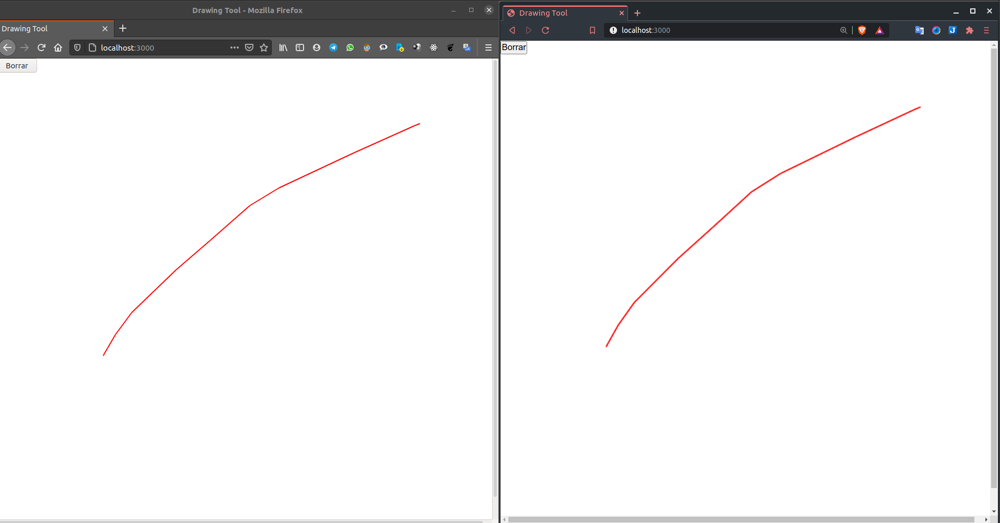

- # **drawing_tool**
    
Simple aplicación de dibujo colaborativa.  
Implementa Node, Express, [socket.io](http://socket.io).



**Web:** [https://drawing0tool.herokuapp.com/](https://drawing0tool.herokuapp.com/)  
**Repo:** [https://github.com/Marto130/drawing_tool](https://github.com/Marto130/drawing_tool)

* * *

Clonar el proyecto:

```
git clone https://github.com/Marto130/drawing_tool
```

Ejecutar:

```
npm install
npm start
```
